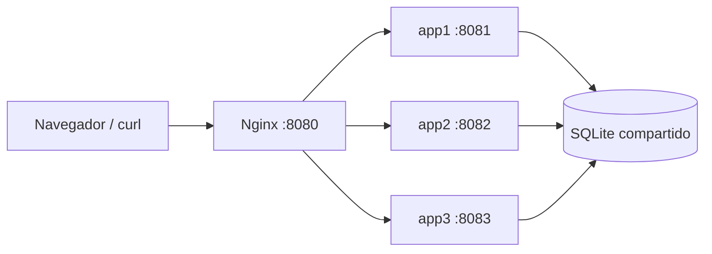

# Lab07 · Login, CRUD y balanceo de carga

Este proyecto responde al laboratorio 7 de Desarrollo de Soluciones en la Nube. La parte local ofrece una aplicación de inventario con login y operaciones CRUD detrás de Nginx, distribuida entre tres servidores. La parte AWS incluye una plantilla para demostrar un Application Load Balancer (ALB), health checks, ruteo por ruta y Auto Scaling.

## Arquitectura



Los tres servidores ejecutan el mismo código. La sesión se firma con una clave común y los registros se guardan en el mismo volumen SQLite. Por ello, cambiar de backend no obliga a iniciar sesión otra vez ni pierde los datos. La cabecera `X-Backend-Id` y la insignia en la página muestran qué servidor atendió cada petición.

## Inicio rápido local

Requisitos: Docker Desktop con Docker Compose. Los puertos 8080 a 8083 deben estar libres.

```bash
cp .env.example .env
# Cambiar SESSION_SECRET y ADMIN_PASSWORD en .env para uso fuera de una demostración local.
docker compose up -d --build
./scripts/smoke.sh
```

Abrir **http://127.0.0.1:8080**. Si se mantienen los valores de ejemplo, el usuario es `admin@lab07.local` y la contraseña es `Lab07Demo!`. Crear, editar y eliminar artículos desde la interfaz. Al recargar, cambia la insignia del servidor y se conservan sesión y registros.

| Dirección | Uso |
|---|---|
| `http://127.0.0.1:8080` | Aplicación mediante Nginx |
| `http://127.0.0.1:8081` | app1 directo |
| `http://127.0.0.1:8082` | app2 directo |
| `http://127.0.0.1:8083` | app3 directo |
| `/health` | Salud del proceso y base de datos |
| `/api/instance` | Identificador del backend |

Los puertos directos están enlazados a `127.0.0.1`, solo para pruebas en el equipo. La aplicación no debe publicarse en Internet con la contraseña de ejemplo ni con HTTP sin TLS.

### API del CRUD

La interfaz usa formularios HTML. También se pueden demostrar los endpoints con `curl`:

```bash
curl -c /tmp/lab07-cookie -H 'Content-Type: application/json' \
  -d '{"email":"admin@lab07.local","password":"Lab07Demo!"}' \
  http://127.0.0.1:8080/api/login

curl -b /tmp/lab07-cookie http://127.0.0.1:8080/api/items

curl -b /tmp/lab07-cookie -H 'Content-Type: application/json' \
  -d '{"name":"Router","description":"Equipo de laboratorio","quantity":3}' \
  http://127.0.0.1:8080/api/items

curl -b /tmp/lab07-cookie -X PUT -H 'Content-Type: application/json' \
  -d '{"name":"Switch","description":"Actualizado","quantity":5}' \
  http://127.0.0.1:8080/api/items/1

curl -b /tmp/lab07-cookie -X DELETE http://127.0.0.1:8080/api/items/1
```

El ID del ejemplo puede cambiar. `GET /api/me` muestra al usuario autenticado y el backend actual. La API acepta también `Authorization: Bearer <token>` con el token devuelto por `/api/login`.

## Algoritmos de balanceo y ejercicios locales

El modo inicial es **Round Robin**. Nginx usa una zona compartida para que el contador sea coherente entre sus procesos de trabajo.

```bash
./scripts/count-distribution.sh 30
./scripts/set-algorithm.sh weighted
./scripts/count-distribution.sh 100
./scripts/set-algorithm.sh least_conn
./scripts/set-algorithm.sh ip_hash
./scripts/set-algorithm.sh round_robin
```

`weighted` aplica pesos **5:3:2**. En una prueba de 100 peticiones secuenciales, la proporción esperada es 50/30/20. `least_conn` elige el servidor con menos conexiones activas: las peticiones secuenciales no bastan para evaluar su ventaja; requiere tráfico concurrente. `ip_hash` mantiene las peticiones del mismo cliente en el mismo backend mientras éste esté disponible. Estos algoritmos son alternativas para el ejercicio, no configuraciones simultáneas.

### Health checks y tolerancia a fallos

Docker comprueba `/health` en cada servidor. Nginx usa checks pasivos `max_fails=2 fail_timeout=15s`: al fallar un backend, lo evita temporalmente y vuelve a probarlo después.

```bash
docker compose stop app2
./scripts/count-distribution.sh 20
docker compose start app2
# Tras unos segundos, confirmar que app2 vuelve a aparecer:
./scripts/count-distribution.sh 30
```

Los checks de Docker informan salud para el arranque; Nginx Open Source usa aquí detección pasiva para retirar un backend durante solicitudes reales.

### Comparación de carga

```bash
./scripts/benchmark.sh
```

El script ejecuta 1000 peticiones con concurrencia 50 primero a app1 y luego a Nginx. Registra peticiones por segundo, tiempo por petición y fallos. Las cifras dependen del equipo, de Docker y del tráfico concurrente; el balanceador puede ser más lento para una respuesta trivial por su salto adicional. Véase [evidencia local](docs/evidence.md).

## AWS

La plantilla [aws/lab07-alb.yaml](aws/lab07-alb.yaml) crea una VPC, dos subredes públicas en distintas zonas, un ALB, un grupo web con dos instancias iniciales gestionadas por Auto Scaling, un backend API, health checks y una regla `/api/*`. Los servidores AWS muestran sus propios ID y zona; son la demostración del ALB solicitada en la guía complementaria. La aplicación de login y CRUD se demuestra localmente con Nginx y base compartida.

La plantilla abre **HTTP 80 al ALB desde Internet**. Los servidores aceptan HTTP solo desde el grupo de seguridad del ALB; no se abre SSH. Este entorno de laboratorio no incluye HTTPS ni datos reales. **ALB, EC2 y otros recursos pueden generar cargos mientras la pila exista.** Despliegue, capturas, pruebas y opciones para conservar o pausar recursos se describen en [guía AWS](docs/aws.md). No se debe afirmar que AWS esté desplegado hasta comprobar sus recursos en la cuenta.

## Pruebas y cierre

```bash
python3 -m unittest discover -s tests -v
docker compose ps
docker compose down
```

`docker compose down` detiene los contenedores y conserva el volumen de datos. Eliminar el volumen requiere `docker compose down -v` y borra los registros del laboratorio.

**Conclusiones:** (1) El balanceador reparte solicitudes y mantiene el servicio si un backend falla. (2) Una sesión firmada y un almacén compartido permiten que el login y el CRUD funcionen al cambiar de servidor. (3) Un ALB con dos zonas, checks y Auto Scaling ofrece más capacidad de recuperación y elasticidad que un único Nginx local, con mayor costo y complejidad operativa.
