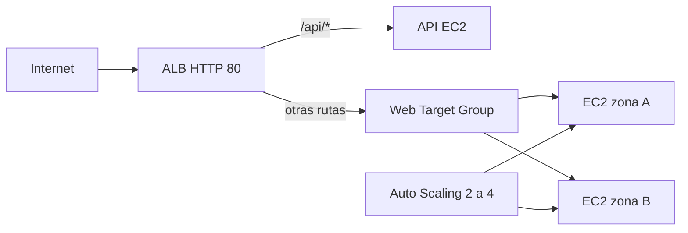

# Despliegue y evidencia del balanceador AWS

Esta guía corresponde a la parte B y a los ejercicios 4 y 5 de `Laboratorio_Balanceador_de_Carga.md`. Región prevista: `us-east-1`. La infraestructura aún debe desplegarse y validarse en la cuenta AWS del laboratorio.

## Antes de crear la pila

1. Revisar en AWS Billing el presupuesto y la elegibilidad del tipo de instancia para la cuenta. La plantilla utiliza `t3.micro` por defecto; la condición de Free Tier depende de la cuenta.
2. Confirmar que no existan recursos con nombres `lab07-*` en la región.
3. Usar solo datos de demostración. El ALB usa HTTP sin TLS para reproducir el ejercicio y queda accesible desde Internet en el puerto 80.

## Crear con CloudFormation

1. En **CloudFormation → Create stack → With new resources**, escoger **Upload a template file**.
2. Subir `aws/lab07-alb.yaml` y avanzar.
3. Nombre de pila: `lab07-alb`.
4. Revisar el parámetro `InstanceType`, la vista previa de recursos y crear.
5. Esperar `CREATE_COMPLETE`. Si falla, abrir **Events** y usar el error concreto para corregir la pila.

La plantilla crea:



Los dos servidores web son gestionados por el Auto Scaling Group (mínimo 2, deseado 2, máximo 4 en el despliegue inicial). Una tercera instancia sirve el endpoint de ejemplo `/api/test`. Los checks del Target Group usan `/health` y `/api/health`. El escalado objetivo se configura a CPU media del 50%.

## Comprobaciones y capturas

1. En **EC2 → Target Groups**, mostrar los dos targets web y el target API en estado `healthy`.
2. En **EC2 → Load Balancers**, copiar el DNS del ALB desde **Details**.
3. En el navegador o terminal, consultar varias veces `http://DNS-DEL-ALB/`: deben alternarse los `Instance ID` y, idealmente, las zonas.
4. Consultar `http://DNS-DEL-ALB/api/test`: debe responder `API SERVER` con el ID de la instancia API.
5. En el listener HTTP:80, mostrar la regla de prioridad 10 con patrón `/api/*` y destino `lab07-api-registration`.
6. Para failover, detener temporalmente **una instancia web** desde EC2, esperar a que el Target Group la marque `unhealthy` y comprobar que el ALB siga respondiendo desde la otra. Al pertenecer a un ASG, la instancia puede ser reemplazada; documentar ese comportamiento.
7. En **Auto Scaling Groups**, mostrar mínimo 2, deseado 2 y máximo 4, la política de CPU al 50% y la asociación al Target Group. Para evidenciar escalado real, generar carga y observar **Activity** y CloudWatch. Una página HTML estática puede no generar suficiente CPU: si no se activa la política, registrar las métricas observadas y no afirmar que escaló.

Pruebas rápidas, sustituyendo el DNS real:

```bash
curl -s http://DNS-DEL-ALB/
curl -s http://DNS-DEL-ALB/api/test
```

**Datos a completar tras el despliegue:** nombre de pila, DNS del ALB, IDs de targets saludables, capturas de rutas, métricas de escalado y hora de eliminación.

## Conservación y pausa de la infraestructura

El usuario ha pedido conservar la infraestructura. Al terminar las pruebas, no basta con detener las instancias web desde EC2: Auto Scaling considera las instancias detenidas como no saludables y las reemplaza. Para pausar la capacidad web sin eliminar la pila, actualizar `lab07-alb` en CloudFormation con `WebMinSize=0` y `WebDesiredCapacity=0`. Esto termina las EC2 web actuales, pero conserva el grupo y su plantilla para volver a `2/2` después. La instancia API no pertenece al grupo y puede detenerse desde EC2; su volumen EBS seguirá teniendo costo.

**El ALB no se puede apagar.** Mientras la pila lo conserve, seguirá consumiendo crédito o generando cargos por hora, además de posibles cargos de IPv4 pública y otros recursos. Para detener los cargos del ALB hay que eliminarlo; una opción reversible es eliminar la pila y volver a desplegarla desde esta plantilla cuando se necesite. No eliminar recursos sin la autorización del usuario.
